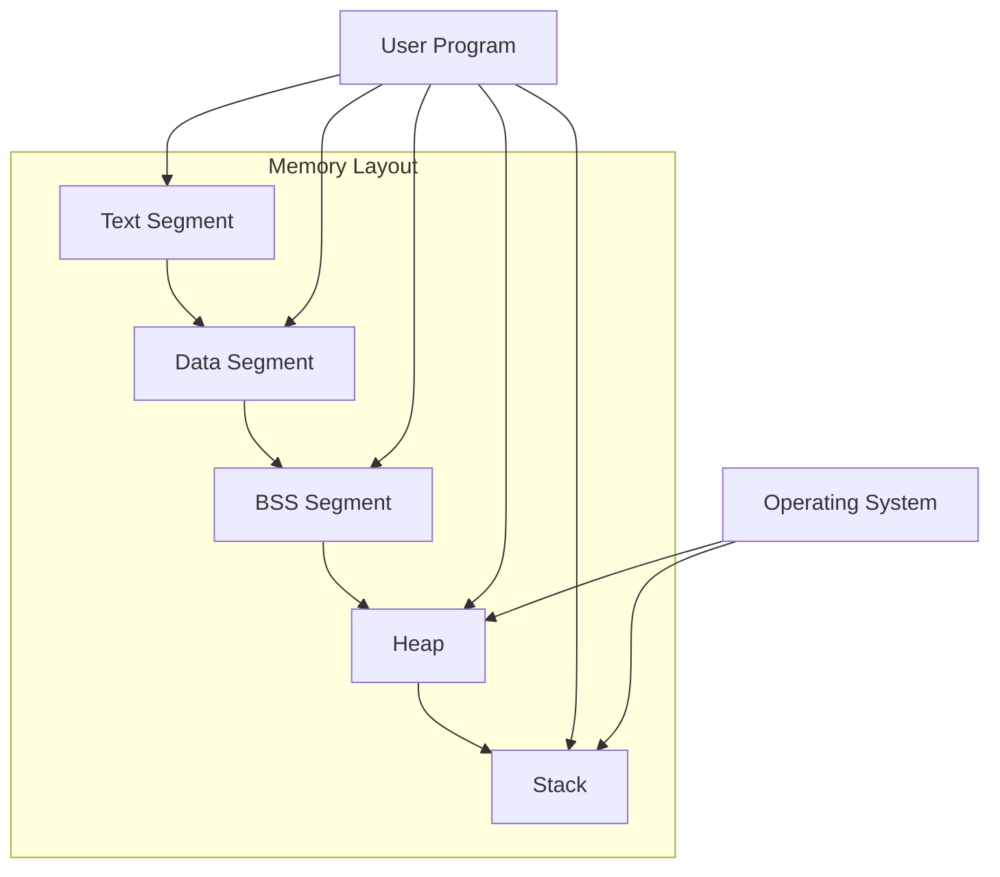

- [How much memory do int, char and other data types take in memory?](#how-much-memory-do-int-char-and-other-data-types-take-in-memory)
- [How much memory do pointers take?](#how-much-memory-do-pointers-take)
- [Can C language return multiple values and if it can - how?](#can-c-language-return-multiple-values-and-if-it-can---how)
  - [1. Using Pointers](#1-using-pointers)
  - [2. Using `struct`](#2-using-struct)
  - [3. Using Arrays](#3-using-arrays)
  - [4. Using Dynamic Memory](#4-using-dynamic-memory)
  - [5. Using Global or Static Variables](#5-using-global-or-static-variables)
  - [Which Method to Use?](#which-method-to-use)
- [Computer memory basics](#computer-memory-basics)
  - [**Markdown Table Representation**](#markdown-table-representation)
  - [**Mermaid Diagram Representation**](#mermaid-diagram-representation)
  - [**Explanation**](#explanation)
  - [Simplified (from CS50)](#simplified-from-cs50)
    - [Our program would look like this:](#our-program-would-look-like-this)

## How much memory do int, char and other data types take in memory?

The memory size of data types in C and C++ depends on the system architecture (32-bit or 64-bit) and the compiler. Here are typical sizes:

| Data Type     | Typical Size (bytes) | Notes                                              |
| ------------- | -------------------- | -------------------------------------------------- |
| `char`        | 1                    | Always 1 byte, but can be signed or unsigned       |
| `short`       | 2                    | At least 16 bits                                   |
| `int`         | 4                    | At least 16 bits, typically 32 bits                |
| `long`        | 4 or 8               | At least 32 bits (often 8 bytes on 64-bit systems) |
| `long long`   | 8                    | At least 64 bits                                   |
| `float`       | 4                    | IEEE 754 single-precision                          |
| `double`      | 8                    | IEEE 754 double-precision                          |
| `long double` | 8, 10, 12, or 16     | Depends on compiler and system                     |

> NOTE: 1 Byte = 8 Bits

To check sizes on your system, use:

```c
#include <stdio.h>

int main() {
    printf("Size of int: %zu bytes\n", sizeof(int));
    printf("Size of char: %zu bytes\n", sizeof(char));
    printf("Size of short: %zu bytes\n", sizeof(short));
    printf("Size of long: %zu bytes\n", sizeof(long));
    printf("Size of long long: %zu bytes\n", sizeof(long long));
    printf("Size of float: %zu bytes\n", sizeof(float));
    printf("Size of double: %zu bytes\n", sizeof(double));
    printf("Size of long double: %zu bytes\n", sizeof(long double));
    return 0;
}
```

Run this to see actual sizes on your machine!

## How much memory do pointers take?

Pointers store memory addresses, so their size depends on the system architecture:  

| Architecture | Pointer Size |
| ------------ | ------------ |
| 32-bit       | 4 bytes      |
| 64-bit       | 8 bytes      |

> NOTE: 1 Byte = 8 Bits

All pointers (`int*`, `char*`, `double*`, etc.) have the same size on a given system because they store addresses, not values.  

You can check pointer sizes on your system using:  

```c
#include <stdio.h>

int main() {
    printf("Size of int*: %zu bytes\n", sizeof(int*));
    printf("Size of char*: %zu bytes\n", sizeof(char*));
    printf("Size of double*: %zu bytes\n", sizeof(double*));
    printf("Size of void*: %zu bytes\n", sizeof(void*));
    return 0;
}
```

## Can C language return multiple values and if it can - how?

The C language does not support directly returning multiple values from a function as many modern languages do. However, there are several common techniques to achieve the same result:

### 1. Using Pointers
You can pass variables as pointers to the function, and the function can modify them directly.

```c
#include <stdio.h>

void getTwoNumbers(int *a, int *b) {
    *a = 10;
    *b = 20;
}

int main() {
    int x, y;
    getTwoNumbers(&x, &y); // Pass the addresses of `x` and `y`
    printf("x = %d, y = %d\n", x, y);
    return 0;
}
```

- **Explanation**: `getTwoNumbers` modifies the values at the memory locations provided by `x` and `y`.

### 2. Using `struct`
You can define a `struct` to group multiple values and return it.

```c
#include <stdio.h>

typedef struct {
    int a;
    int b;
} TwoNumbers;

TwoNumbers getTwoNumbers() {
    TwoNumbers result;
    result.a = 10;
    result.b = 20;
    return result;
}

int main() {
    TwoNumbers numbers = getTwoNumbers(); // Function returns a struct
    printf("a = %d, b = %d\n", numbers.a, numbers.b);
    return 0;
}
```

- **Explanation**: A `struct` allows bundling multiple variables together, which the function returns as a single entity.

### 3. Using Arrays
Return multiple values via an array.

```c
#include <stdio.h>

void getTwoNumbers(int arr[]) {
    arr[0] = 10;
    arr[1] = 20;
}

int main() {
    int results[2];
    getTwoNumbers(results); // Pass an array to hold results
    printf("a = %d, b = %d\n", results[0], results[1]);
    return 0;
}
```

- **Explanation**: The function populates the passed array with the desired values.

### 4. Using Dynamic Memory
Allocate memory dynamically for the results and return a pointer.

```c
#include <stdio.h>
#include <stdlib.h>

int* getTwoNumbers() {
    int *result = malloc(2 * sizeof(int));
    result[0] = 10;
    result[1] = 20;
    return result;
}

int main() {
    int *numbers = getTwoNumbers(); // Dynamically allocated
    printf("a = %d, b = %d\n", numbers[0], numbers[1]);
    free(numbers); // Free the allocated memory
    return 0;
}
```

- **Explanation**: The function allocates memory for the values and returns a pointer to it. You must remember to `free` the memory later.

### 5. Using Global or Static Variables
Store the results in global or static variables and access them after the function call.

```c
#include <stdio.h>

int a, b;

void getTwoNumbers() {
    a = 10;
    b = 20;
}

int main() {
    getTwoNumbers();
    printf("a = %d, b = %d\n", a, b);
    return 0;
}
```

- **Explanation**: The function modifies global or static variables directly. However, this approach is less preferred due to potential side effects.

### Which Method to Use?
- **Pointers**: Best for modifying existing variables.
- **Structs**: Ideal for returning multiple logically related values.
- **Arrays**: Useful when dealing with homogeneous data.
- **Dynamic Memory**: Use cautiously, ensuring proper memory management.
- **Globals**: Avoid unless absolutely necessary.

## Computer memory basics
Below is a **graphical representation of computer memory** using **Markdown tables** and a **Mermaid diagram**, explaining what each section represents.

### **Markdown Table Representation**
| Memory Segment   | Purpose                                                                                      | Example                                                    |
| ---------------- | -------------------------------------------------------------------------------------------- | ---------------------------------------------------------- |
| **Stack**        | Stores local variables, function calls, and return addresses. Grows and shrinks dynamically. | `int x = 10;` declared in a function resides here.         |
| **Heap**         | Dynamically allocated memory during runtime using functions like `malloc()`.                 | Memory for `int *ptr = malloc(sizeof(int));` resides here. |
| **Data Segment** | Stores global and static variables.                                                          | `static int count = 0;` or `int globalVar = 42;`.          |
| **Text Segment** | Contains the program's compiled machine code (instructions).                                 | Instructions of your `main()` function reside here.        |
| **BSS Segment**  | Stores uninitialized global and static variables. Initialized to zero by default.            | `static int count;` without an explicit initialization.    |

### **Mermaid Diagram Representation**



### **Explanation**
1. **Text Segment**:
   - Contains the compiled instructions for your program (read-only).
   - Example: Machine code of the `main()` function.

2. **Data Segment**:
   - Contains initialized global and static variables.
   - Example: `int globalVar = 42;`.

3. **BSS Segment**:
   - Contains uninitialized global and static variables.
   - Default-initialized to zero by the OS.
   - Example: `static int count;`.

4. **Heap**:
   - Used for dynamic memory allocation (`malloc`, `calloc`, `realloc`).
   - Memory must be managed explicitly (freed using `free()`).
   - Grows upwards toward the stack.

5. **Stack**:
   - Stores function call information, local variables, and return addresses.
   - Grows downwards (toward the heap).
   - Automatically managed by the program.

6. **Operating System**:
   - Manages memory allocation and ensures processes don't interfere with each other.

### Simplified (from CS50)

| machine code | explanation                     |
| ------------ | ------------------------------- |
| globals      |                                 |
| heap         | grows downwards, towards stack  |
| ...          |                                 |
| ...          |                                 |
| ...          |                                 |
| stack        | grows upwards, towards the heap |

#### Our program would look like this:

| machine code                      | explanation                                     |
| --------------------------------- | ----------------------------------------------- |
| `int x = 10;`                     | declared in a function resides here             |
| `int *ptr = malloc(sizeof(int));` | `malloc` is used to allocate memory dynamically |
| `int count = 0;`                  | initialized to zero by default                  |
| `int globalVar = 42;`             | declared in a function resides here             |
| `static int count = 0;`           | declared in a function resides here             |
| `int globalVar = 42;`             | declared in a function resides here             |